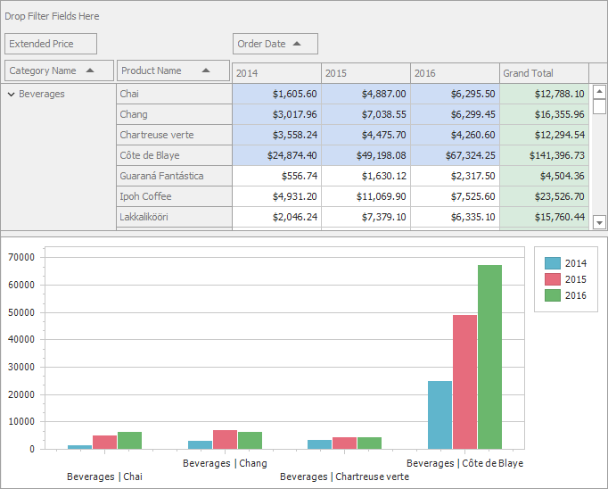

<!-- default badges list -->

<!-- default badges end -->

# WinForms - How to visualize Pivot Grid Data in the Chart Control

The following example shows how to integrate the Pivot Grid with the Chart control. The [PivotGridControl](https://docs.devexpress.com/WindowsForms/DevExpress.XtraPivotGrid.PivotGridControl) instance is assigned to the [ChartControl.DataSource](https://docs.devexpress.com/WindowsForms/DevExpress.XtraCharts.ChartControl.DataSource) property that allows the Chart to load and visualize data directly from the Pivot Grid. 

<!-- default file list -->

## Files to Review

[Form1.cs](./CS/XtraPivotGrid_ChartsIntegration/Form1.cs) (VB: [Form1.vb](./VB/XtraPivotGrid_ChartsIntegration/Form1.vb))
<!-- default file list end -->

## Documentation

[Integrate the Pivot Grid with the Chart Control](https://docs.devexpress.com/WindowsForms/8748/controls-and-libraries/pivot-grid/data-analysis/integration-with-the-chart-control)

## More Examples

- [WinForms - Customize Pivot Grid's Data before Displaying it in the Chart Control](https://github.com/DevExpress-Examples/customize-pivot-grid-controls-data-before-displaying-it-in-a-chart-control-e2214)
- [WinForms - Print a Document that Contains Pivot and Chart Controls](https://github.com/DevExpress-Examples/winforms-print-pivot-and-chart-controls)
- [WinForms - How to Hide Unnecessary Series from the Chart (Pivot Grid - Chart Integration)](https://github.com/DevExpress-Examples/winforms-pivot-chart-integration-hide-unnecessary-series-from-the-chart)
